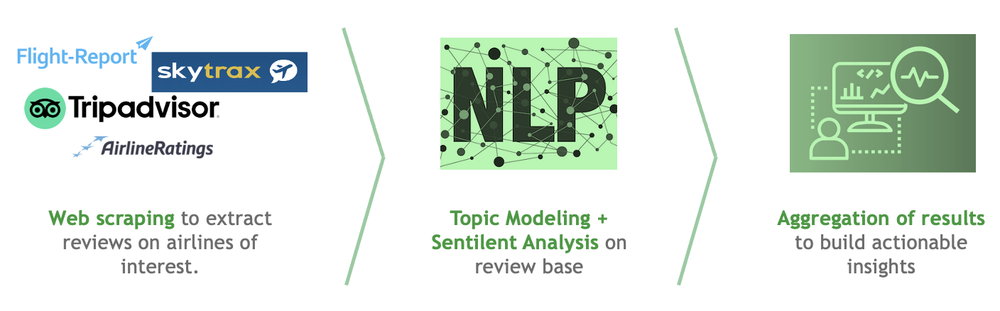

# Air Force 11

<table>
  <tr>
    <td>Why ?</td>
     <td>Because.</td>
  </tr>
  <tr>
    <td></td>
    <td></td>
  </tr>
 </table>

## Description 

The client, a player in the aeronautic industry, wants to understand how the user experience of airplane passengers can be improved. 

Several websites enable users to share their experience, thereby providing valuable data sourceswith large and various information. We choose to scrape **Trip Advisor**, **SkyTrax**, **Airline Reviews** and **Flight Report**.

The goal is to leverage webscrapingtechniques, topic modelling and sentiment analysis algorithms as well as your business sense to provide insights on possible business opportunities.

## Repository Architecture

```
air-force-11
├── img
│   └── Images for README
├── model
│     ├── __init.py__
│     │── embedding_nmf.py
│     │── preprocess.py
│     │── sentiment_analysis.py
│     └── topic_modeling_gensim.py
├── scraping_scripts
│     ├── __main.py__ 
│     │── airlineratings_airline_categories_and_ratings.py 
│     │── airlineratings.py
│     │── flight_report.py
│     │── trip_advisor_airlines.py
│     └── trip_advisor.py
├── requirements.txt
└── main.py
```

## Approach



## Model 


* **Preprocessing**

The preprocessing step consists of the following steps:
1. Remove ponctuation
2. Remove stopwords
3. Tokenization using a pretrained BERT Tokenizer
4. Remove reviews that speaks about covid and canceled flights
5. Lemmatization

* **Topic Modeling**

We implemeted two different approaches : **LDA with gensim** and **Non-negative matrix factorization (NMF)**

However we chose to go with NMF embeddings as they were faster

* **Aspect Based Sentiment Analysis**
 
Using the topics extracted via the topic modeling step, we used the library **[aspect-based-sentiment-analysis](https://pypi.org/project/aspect-based-sentiment-analysis/)** to extract the sentiment of the reviews with regards to each of those topics


## Setup python project

First clone the project

```bash
git clone git@github.com:berradiayounes/air-force-11.git
```

We're using the python native environment manager for our development workflow. 
For more info, click [here](https://packaging.python.org/guides/installing-using-pip-and-virtual-environments/)

To setup the environment and the dependencies:

```bash
python3 -m pip install -r requirements.txt
```

When using gensim to genrate features, you need to download the corpus `mallet-2.0.8`

```bash
curl -O "http://mallet.cs.umass.edu/dist/mallet-2.0.8.zip"
unzip mallet-2.0.8.zip 
```

## Command Line Instructions (CLI)

### Activate the virtual environment

```bash
source air-force-11/bin/activate
```

### Command Lines

* **Main command** 

```bash
python main.py
```

* **Options**

    ```bash
    python main.py --from_scratch 
    ```
   Create the preprocessed dataframe and run the rest with the default options

    ```bash
    python main.py --method nmf
    ```
    Use NMF to create embeddings and generate topics

    ```bash 
    python main.py --method gensim
    ```
    Use LDA to generate topics

## Linting

We use [black](https://github.com/psf/black) as our default linter.

 