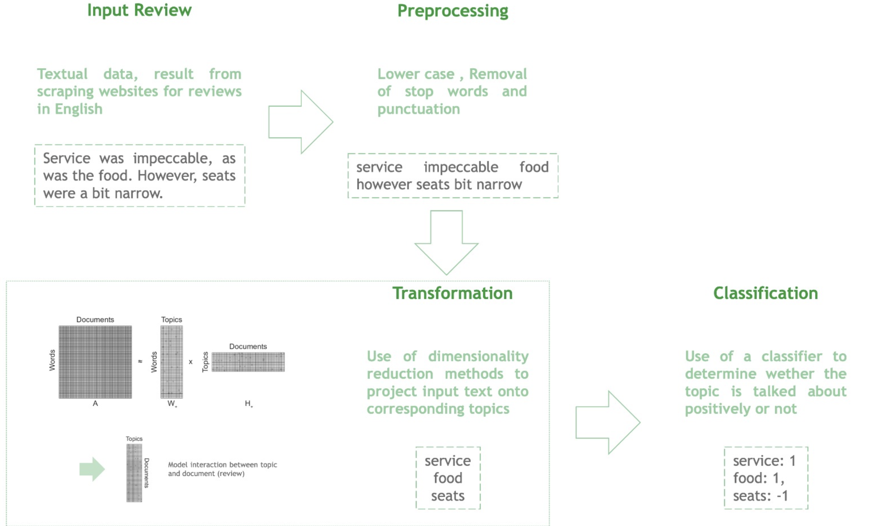

# Air Force 11

<table>
  <tr>
    <td>Why ?</td>
     <td>Because.</td>
  </tr>
  <tr>
    <td></td>
    <td></td>
  </tr>
 </table>

 ## Team

 <table>
  <tr>
    <td>Berradia Younes</td>
    <td>Gautron Alexandra</td>
    <td>Gouget Nicolas</td>
    <td>Omari Yassine</td>
    <td>Simon Oriane</td>
  </tr>
  <tr>
    <td></td>
    <td></td>
    <td></td>
    <td></td>
    <td></td>
  </tr>
 </table>

## Description 

The client, a player in the aeronautic industry, wants to understand how the user experience of airplane passengers can be improved. 

Several websites enable users to share their experience, thereby providing valuable data sources with large and various information. We chose to scrape **[Trip Advisor](https://www.tripadvisor.fr/Airlines)**, **[SkyTrax](https://www.airlinequality.com/review-pages/a-z-airline-reviews/)**, **[Airline Ratings](https://www.airlineratings.com/airline-passenger-reviews)** and **[Flight Report](https://flight-report.com/en/airline/)**.

The goal is to leverage webscraping techniques, topic modeling and sentiment analysis algorithms to provide insights on possible business opportunities.

## Repository Architecture

```
air-force-11
├── img
│   └── Images for README
├── model
│     ├── __init.py__
│     │── embedding_nmf.py
│     │── preprocess.py
│     │── sentiment_analysis.py
│     └── topic_modeling_gensim.py
├── scraping_scripts
│     ├── __main.py__ 
│     │── airlineratings_airline_categories_and_ratings.py 
│     │── airlineratings.py
│     │── flight_report.py
│     │── trip_advisor_airlines.py
│     └── trip_advisor.py
├── requirements.txt
└── main.py
```

## Approach


## Scraping

In the folder scraping_scripts, you can find all the scripts used to scrape the websites cited above.

We used the libraries **Request**, **Beautiful Soup (bs4)** and **Selenium** to get the reviews.

Each script is specific to the website, but the core approach is the same for the websites we surveyed:

1. Get the airline names and the links to the pages where the reviews can be found
2. For each of those links, extract the reviews found

First step explains why you can find two scripts, the first one for the first part and the second for the second part.

Eventually, once all websites are scraped, you can concanate them using the script in **__main__.py**.

## Model 



* **Preprocessing**

The preprocessing step consists of the following steps:
1. Remove ponctuation
2. Remove stopwords
3. Tokenize using a pretrained BERT Tokenizer
4. Remove reviews that speak about covid and cancelled flights
5. Lemmatize

* **Topic Modeling**

We implemeted two different approaches : **LDA with gensim** and **Non-negative matrix factorization (NMF)**.

However we chose to go with NMF embeddings as they were faster.

* **Aspect Based Sentiment Analysis**
 
Using the topics extracted via the topic modeling step, we used the library **[aspect-based-sentiment-analysis](https://pypi.org/project/aspect-based-sentiment-analysis/)** to extract the sentiments of the reviews with regards to each of those topics.


## Setup python project

First clone the project

```bash
git clone git@github.com:berradiayounes/air-force-11.git
```

We're using the python native environment manager for our development workflow. 
For more info, click [here](https://packaging.python.org/guides/installing-using-pip-and-virtual-environments/)

To setup the environment and the dependencies:

```bash
python3 -m venv air-force-11
python3 -m pip install -r requirements.txt
```

When using gensim to generate features, you need to download the corpus `mallet-2.0.8`

```bash
curl -O "http://mallet.cs.umass.edu/dist/mallet-2.0.8.zip"
unzip mallet-2.0.8.zip 
```

## Command Line Instructions (CLI)

### Activate the virtual environment

```bash
source air-force-11/bin/activate
```

### Command Lines

* **Main command** 

```bash
python main.py
```

* **Options**

    ```bash
    python main.py --from_scratch 
    ```
   Create the preprocessed dataframe and run the rest with the default options

    ```bash
    python main.py --method nmf
    ```
    Use NMF to create embeddings and generate topics

    ```bash 
    python main.py --method gensim
    ```
    Use LDA to generate topics

* **Scraping commands**

:warning: Some scrapings use **Selenium** web drivers. Please download the chrome driver [here](https://chromedriver.chromium.org/downloads) and put in the **scraping_scripts** directory.

  * **Trip Advisor**

    1. Get Airline Names
    ```bash 
    python scraping_scripts/trip_advisor_airlines.py
    ```
    2. Get Airline Reviews and Ratings
    ```bash 
    python scraping_scripts/trip_advisor.py
    ```

  * **Airline Ratings**

      1. Get Airline Review
      ```bash 
      python scraping_scripts/airlineratings.py
      ```
      2. Get Airline Reviews and Ratings
      ```bash 
      python scraping_scripts/airlineratings_airline_categories_and_ratings.py
      ```
   * **SkyTrax**
      * Get Airline Reviews and Ratings
        ```bash
        python scraping_scripts/skytrax.py
        ```
  * **Flight Report**
      * Get Airline Reviews and Ratings
        ```bash
        python scraping_scripts/flight_report.py
        ```
  * **Finally**, to get the concatenated reviews:
    ```bash
    python scraping_scripts
    ```

## Linting

We use [black](https://github.com/psf/black) as our default linter.

 
